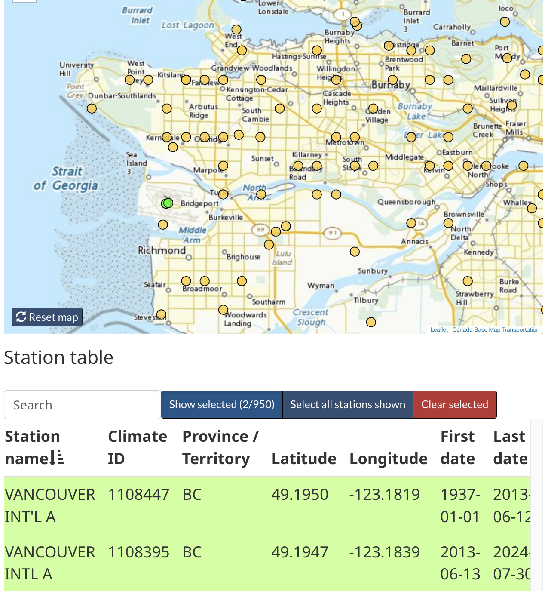
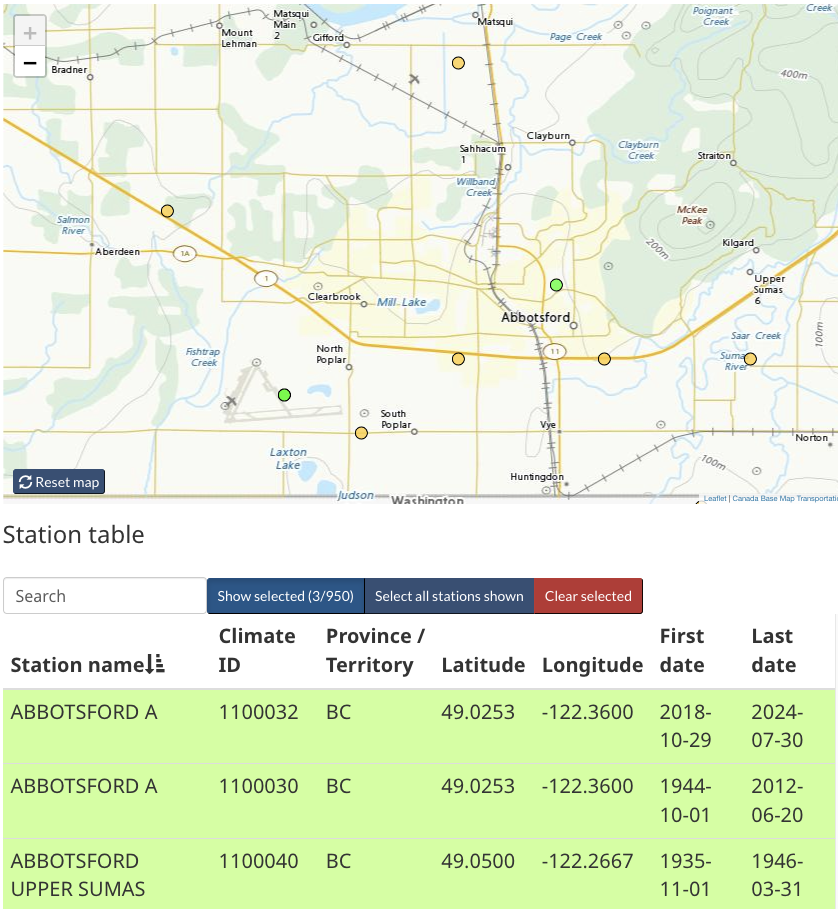
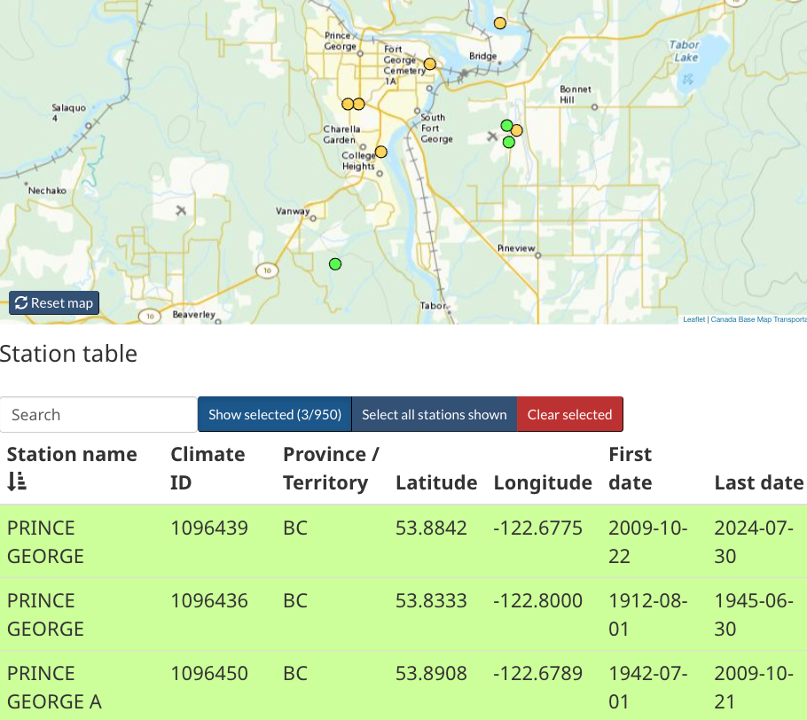
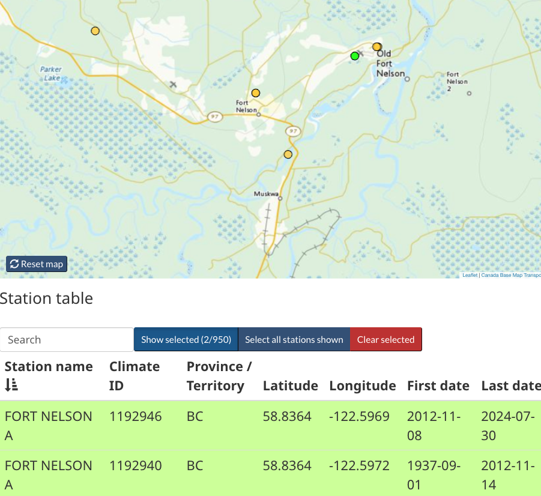
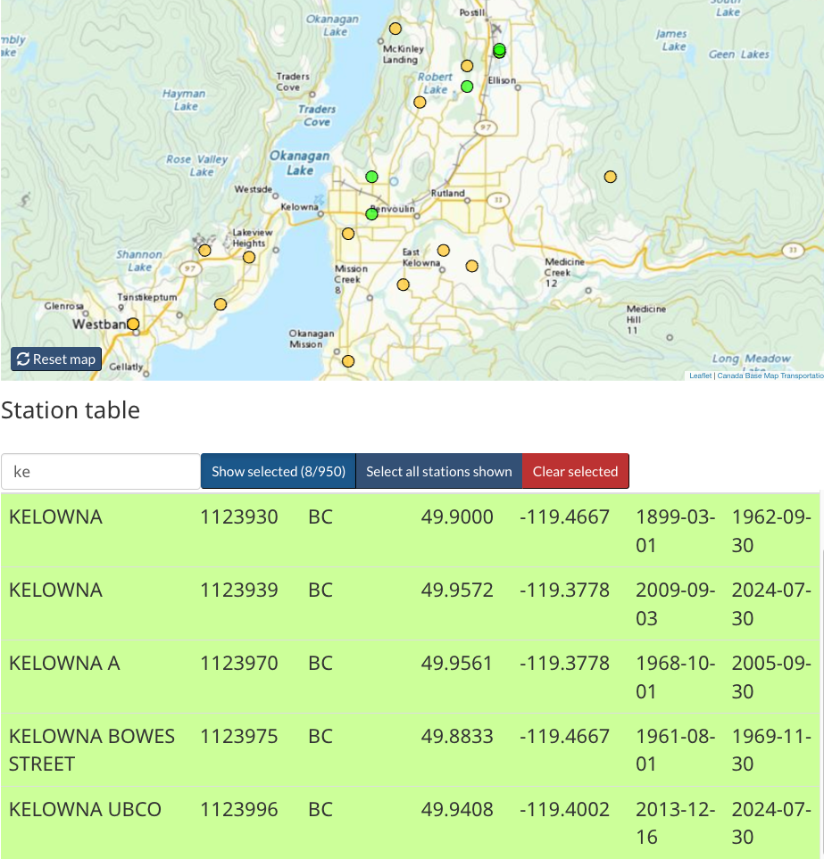
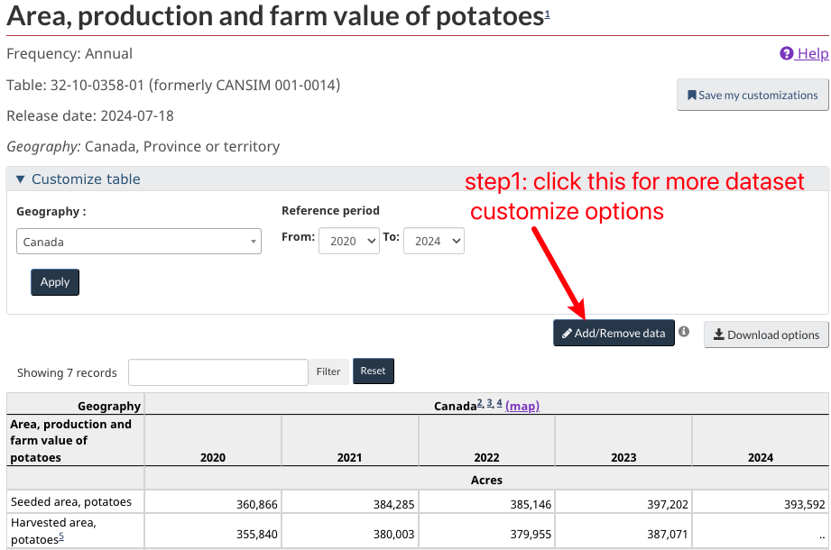
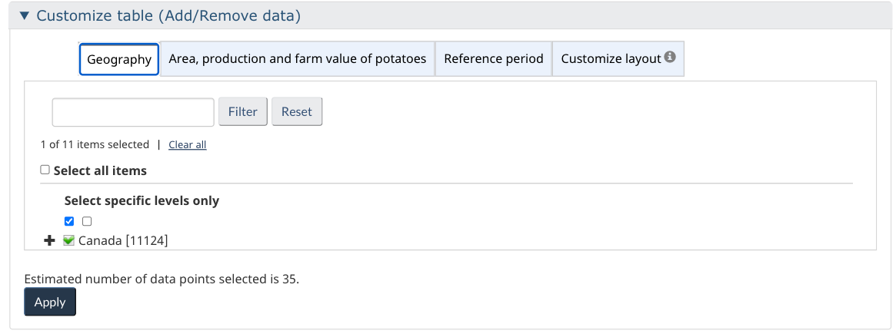
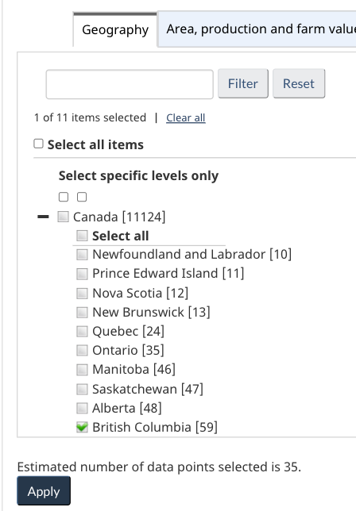
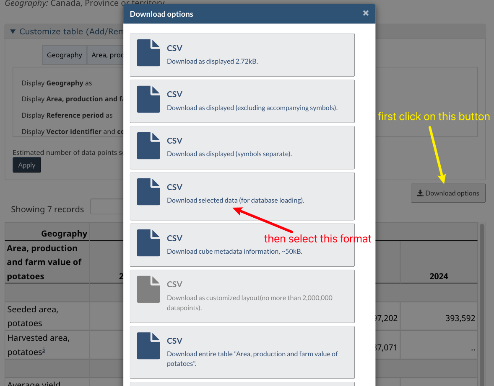
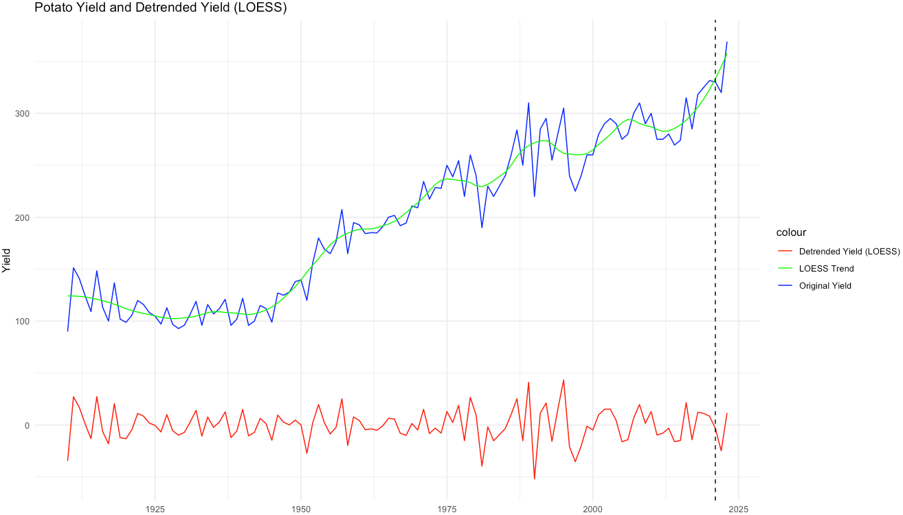

## R Markdown

This document provides a summary of various data sources used in our analysis, along with references to the R code that handles data reading and cleaning.

## Data Source

### TDClimate

 

 

|                                                                                                                                                                                     |
|-------------------------------------------------------------------------------------------------------------------------------------------------------------------------------------|
| \#### 1. Temperature Station                                                                                                                                                        |
| \#### **1.1 Description:**                                                                                                                                                     |
| We are examining daily climate data from temperature stations across Canada, focusing on five key stations that are most representative of the entire province of British Columbia. |
| The dataset includes the following columns:                                                                                                                                         |

**x**: Longitude\
**y**: Latitude\
**LOCAL_DATE**: Date in the format year-month-day\
**TOTAL_PRECIPITATION**: Total precipitation in mm\
**STATION_NAME**: Name of the station\
**MEAN_TEMPERATURE**: Mean of daily maximum and minimum temperatures\
**MAX_TEMPERATURE**: Daily maximum temperature\
**MIN_TEMPERATURE**: Daily minimum temperature\
**TOTAL_RAIN**: Total rainfall\
**MIN_REL_HUMIDITY**: Minimum relative humidity\
**LOCAL_YEAR**: Year\
**LOCAL_MONTH**: Month\
\| *Our goal is to identify stations with data extending back to 1941 in order to compare the heatwave of 1941 with that of 2021.*\
\|  \
\|  \
\| \#### 1.2 Data Access\
\| **Link to data source:** [Daily Climate Station Data](https://climate-change.canada.ca/climate-data/#/daily-climate-data)\
\| Through the provided link, you can utilize the map tool to locate your desired station by either scrolling through the map or entering the station name or ID in the search bar. Please ensure you download the data in CSV format, rather than GeoJSON. (Specific station information, including location and ID, can be found in section 1.3.)\
\| If the link does not work, the data can be accessed through the official website of the Government of Canada by following the navigation path outlined below:\
\| [Home](https://www.canada.ca/en.html) \> [Environment and natural resources](https://www.canada.ca/en/services/environment.html) \> [Climate change](https://www.canada.ca/en/services/environment/weather/climatechange.html) \> [Climate change: our plan](https://www.canada.ca/en/services/environment/weather/climatechange/climate-plan.html) \> [Adapting to Climate Change](https://www.canada.ca/en/environment-climate-change/services/climate-change/adapting.html) \> [Canadian Centre for Climate Services](https://www.canada.ca/en/environment-climate-change/services/climate-change/canadian-centre-climate-services.html) \> [Display and Download Climate Data](https://www.canada.ca/en/environment-climate-change/services/climate-change/canadian-centre-climate-services/display-download.html) \> [Climate data extraction tool](https://climate-change.canada.ca/climate-data/#/) \> Daily climate data (the link above) \| \|  \
\|  \
\| \#### 1.3 Weather Station Location & Year Range\
\| \##### **YVR**\
year range: 1937-2024\
\| \| Station Name \| Start Year \| End Year \| Station ID \| Start Date \| End Date \| \|------------------\|------------\|----------\|------------\|------------\|------------\| \| VANCOUVER INTL A \| 1937 \| 2024 \| 1108447 \| 1937-01-01 \| 2024-08-01 \| \| VANCOUVER INTL A \| 1937 \| 2024 \| 1108395 \| 2013-06-13 \| 2024-08-01 \|\
\| \##### **location information:**\
\| {width="566"}\
\|  \
\|  \
\| \##### Abbotsford\
year range: 1935-2024\
\| \| Station Name \| Start Year \| End Year \| Station ID \| Start Date \| End Date \| \|------------\|------------\|------------\|------------\|------------\|------------\| \| ABBOTSFORD A \| 2012 \| 2024 \| 1100032 \| 2012-06-21 \| 2024-07-30 \| \| ABBOTSFORD A \| 1944 \| 2024 \| 1100030 \| 1944-10-01 \| 2012-06-20 \| \| ABBOTSFORD UPPER SUMAS \| 1935 \| 1946 \| 1100040 \| 1935-11-01 \| 1946-03-31 \|\
\| \##### **location information:**\
\| {width="556"}\
\|  \
\|  \
\| \##### Prince_George\
year range: 1940-2024\
\| \| Station Name \| Start Year \| End Year \| Station ID \| Start Date \| End Date \| \|-----------------\|------------\|----------\|------------\|------------\|------------\| \| PRINCE GEORGE A \| 1942 \| 2009 \| 1096450 \| 1942-07-01 \| 2009-10-21 \| \| PRINCE GEORGE \| 2009 \| 2024 \| 1096439 \| 2009-10-22 \| 2024-07-30 \| \| PRINCE GEORGE \| 1912 \| 1945 \| 1096436 \| 1912-08-01 \| 1945-06-30 \|\
\| \##### **location information :**\
\| {width="569"}\
\|  \
\|  \
\| \#### FortNelson\
year range: 1937-2024\
\| \| Station Name \| Start Year \| End Year \| Station ID \| Start Date \| End Date \| \|---------------\|------------\|----------\|------------\|------------\|------------\| \| FORT NELSON A \| 1937 \| 2012 \| 1192940 \| 1937-09-01 \| 2012-11-14 \| \| FORT NELSON A \| 2012 \| 2024 \| 1192946 \| 2012-11-08 \| 2024-07-30 \|\
\| \##### **location information :**\
\| {width="544"}\
\|  \
\|  \
\| \##### Kelowna\
year range: 1899-2024\
\| \| Station Name \| Start Year \| End Year \| Station ID \| Start Date \| End Date \| \|--------------\|------------\|----------\|------------\|------------\|------------\| \| KELOWNA \| 1899 \| 1962 \| 1123930 \| 1899-03-01 \| 1962-09-30 \| \| KELOWNA \| 1961 \| 1969 \| 1123975 \| 1961-08-01 \| 1969-11-30 \| \| KELOWNA A \| 1968 \| 2005 \| 1123970 \| 1968-10-01 \| 2005-09-30 \| \| KELOWNA \| 2009 \| 2024 \| 1123939 \| 2009-09-03 \| 2024-07-30 \| \| KELOWNA UBCO \| 2013 \| 2024 \| 1123996 \| 2013-12-16 \| 2024-07-30 \|\
\| \##### **location information :**\
\| {width="603"}\
\|  \
\|  \
It is important to note that total precipitation data from 1123939 station (years 2009 to 2024) may be incomplete.To ensure data integrity, particularly for calculating the maximum consecutive dry day, missing precipitation values have been supplemented with data from a nearby secondary UBC-O station. Since treating missing data as zero would significantly distort the calculation of consecutive dry days. - The original Kelowna dataset contained 191 missing values, while the UBC-O dataset provided 343 complete data points. After supplementation, the Kelowna dataset now contains 132 missing values, indicating that 59 missing values were filled. within 2013-2024 period. \|

#### In the early stages of our analysis, we explored data from the following stations:

Kamloops: 1939-2024

Penticton: 1941-2024

#### For analyzing the relationship between temperature and field crop yield data, we picked the station from the Peach River region:

FortStJohn: 1910-2024

 

 

#### 1.4 R code for data reading & cleaning

-   The data is read using the `process_and_save_data()` function, located in `../climate_extreme_RA/R/read_data_(#accrodingly station name).R`

    -   Within the `process_and_save_data()` function, `deal_with_non_exist_date()` detects missing dates (i.e., dates that should be present based on the expected continuous time series but are absent). The function addresses these missing rows by adding rows for these dates and filling in `NA` for the other value columns.

         

    -   **Note:** When there is an overlap in the date ranges of different station data, I manually(before running `process_and_save_data()` to read the data ) remove the rows with overlapping dates from the older station data and retain the corresponding rows from the newer station data.

        For example, given two date ranges:

        -   Station A: October 1, 1944, to June 20, 2012

        -   Station B: November 1, 1935, to March 31, 1946

        I will preserve the data from Station B for the period from November 1, 1935, to September 30, 1944, and the data from Station A for the period from October 1, 1944, to June 20, 2012.This adjusted data then becomes the original raw data.

-   The raw data path is specified at the beginning of each station's analysis R Markdown file, located in `../climate_extreme_RA/reports_station/(# According Station Name)_heatwave_analysis.Rmd`

 

### 2 ERA5

#### **2.1 Description:**

<!-- This dataset provide the -->

<!-- 1.data 介绍 -->

<!-- 2 web 介绍 (关于如何取grid 见onneonte) 如何script 介绍 -->

<!-- 3 code 介绍 -->

<!-- (看onenote 关于时区) -->

<!-- week 3 4 -->

|                                 |
|---------------------------------|
| \### 3 STATCanada Potato data   |
| \#### **3.1 Description:** |

Dataset ID: "Table: 32-10-0358-01 (formerly CANSIM 001-0014)"\
Year Range: 1910-2024\
Frequency: Annual\
Variables: Avg Yield, unit is Hundredweight per harvested acre\
Geography: Canada, Province-wide: British Columbia (BC); Other provinces\
Rationale for choosing potatoes: According to [@potato-heat], potatoes are highly vulnerable to high temperatures, which negatively impact tuber development, storage, and seed potato fitness. \| \| To investigate the potential correlation between temperature extremes, including heat waves, and long-term yield patterns in British Columbia, a comprehensive yield dataset is required. \| \|  \
\| \#### 3.2 Data Access\
\| **Link to data source:** [Statistics Canada](https://www150.statcan.gc.ca/t1/tbl1/en/cv.action?pid=3210035801)\
\| If the link does not work, the data can be accessed through the official website of the Statistics Canada by following the navigation path outlined below:\
\| [Home](https://www150.statcan.gc.ca/n1/en) \> [Data](https://www150.statcan.gc.ca/n1/en/type/data?MM=1#tables) (in the search bar, search for "Area, production and farm value of potatoes" or Dataset ID: 32-10-0358-01) \> [Area, production and farm value of potatoes](http://www150.statcan.gc.ca/t1/tbl1/en/tv.action?pid=3210035801) \| \|  \
\| \#### 3.3 Select and download data in the web\
**Step1**: click the Add/Remove button\
\| {width="621"}\
\| <!-- -->\
**Step2**: the pic below shows the layout of column filter option\
**Step2.1** Select the Geography:\
\| {width="291"}\
Click on the **Geography** tab.\
Don't Check the box next to "Canada" as it will include nationwide data for the entire country.\
Expand the list by clicking the "+" symbol next to "Canada." and select the desired provinces: British Columbia (BC).\
**Step2.2** Choose the Variables:\
Navigate to the **Area, production and farm value of potatoes** tab.\
\| <!-- -->\
From the list of available variables, select only `Average yield, potatoes`\
**Step2.3** Click on the **Reference period** tab.\
Select the years, ranging from 1910 to 2024.\
**Step2.4** Customize the Layout:\
Adjust the layout settings as preferred. Note that these settings will only affect the display of the dataset on the website and will not influence the structure of the data when it is downloaded. \| **Step 3**: Download the dataset\
\| \
First Click on the "Download options" Button, then from the list of available download formats, choose the "Download selected data (for database loading)."\
\| \#### 3.3 R code for data reading & wrangling\
The data is read within `../climate_extreme_RA/R_agricultural/read_data.R`\
\| \`\`\` r \# File paths for Potato data file_paths \<- c("../data/agri/Potato_Data.csv")\
\| \# Define the columns needed,UOM is unit, VALUE is yield needed_columns \<- c("REF_DATE", "VALUE","UOM")\
\| \# Function to read and select necessary columns, and add crop type read_and_select_pot \<- function(file_path) { read_csv(file_path) %\>% select(all_of(needed_columns)) }\
\| \# Read and combine all datasets data_pot \<- map_dfr(file_paths, read_and_select_pot)\
\| #create new column called crop type data_pot\$Crop_Type \<- "Potato" \`\`\`\
The final data is called data_pot\
`../climate_extreme_RA/R_agricultural/model_potato.R` uses a Moving Average to Detrend Time Series yield Data(transfer from Blue line to red line) \| \| Then, the functions within the file are employed as follows: `lm_monthly_potato` and `lm_season_potato` are used to fit potato yield which is annually yield across British Columbia, VS EHF (utilizing daily maximum EHF from ***Kelowna*** as independent variables, aggregated into monthly or seasonal maximums for each year) through linear regression. Additionally, `lm_onemonth_potato` is used to fit 12 single-month EHF versus yield linear regressions. \| \| \#### 3.4 Conclusion\
The adjusted R-squared values are low for all linear models, and the correlation, as observed through scatter plots, varies and is difficult to discern.\
Upon examining the daily EHF curves from the 40 highest and 40 lowest yield years, no clear pattern distinguishes the curves between high and low yield years.\
This detailed analysis can be found in the report located at `../climate_extreme_RA/reports_station/Kelowna_heatwave_analysis.Rmd`\
\| and `../climate_extreme_RA/report_agricultural/agri_lm_model.Rmd`in `Part 2: patato data`

### 4 STATCanada Fruits data

#### **3.1 Description:**

-   Dataset ID: "Table: 32-10-0358-01 (formerly CANSIM 001-0014)"

-   Year Range: 1910-2024

-   Frequency: Annual

-   Variables: Avg Yield, unit is Hundredweight per harvested acre

-   Geography: Canada, Province-wide: British Columbia (BC); Other provinces

-   Rationale for choosing potatoes: According to [@potato-heat], potatoes are highly vulnerable to high temperatures, which negatively impact tuber development, storage, and seed potato fitness.

To investigate the potential correlation between temperature extremes, including heat waves, and long-term yield patterns in British Columbia, a comprehensive yield dataset is required.

 

<!-- agriculture -->

<!-- 5 fao -->

<!-- 6 stat canada -->

<!-- 6.1 potato -->

<!-- 6.2 veg -->

<!-- 6.3 fruits -->

<!-- 6.4 field crop -->

<!-- ## paper -->

# Reference
