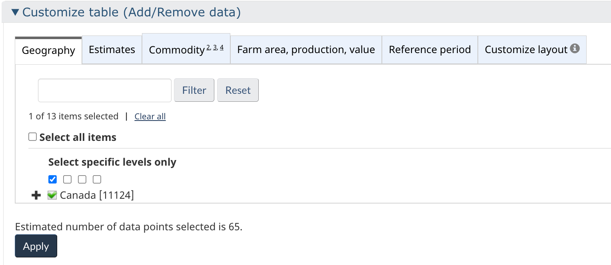
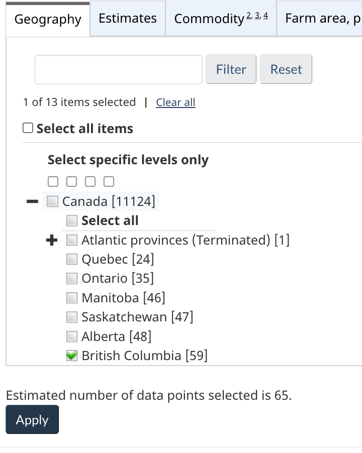
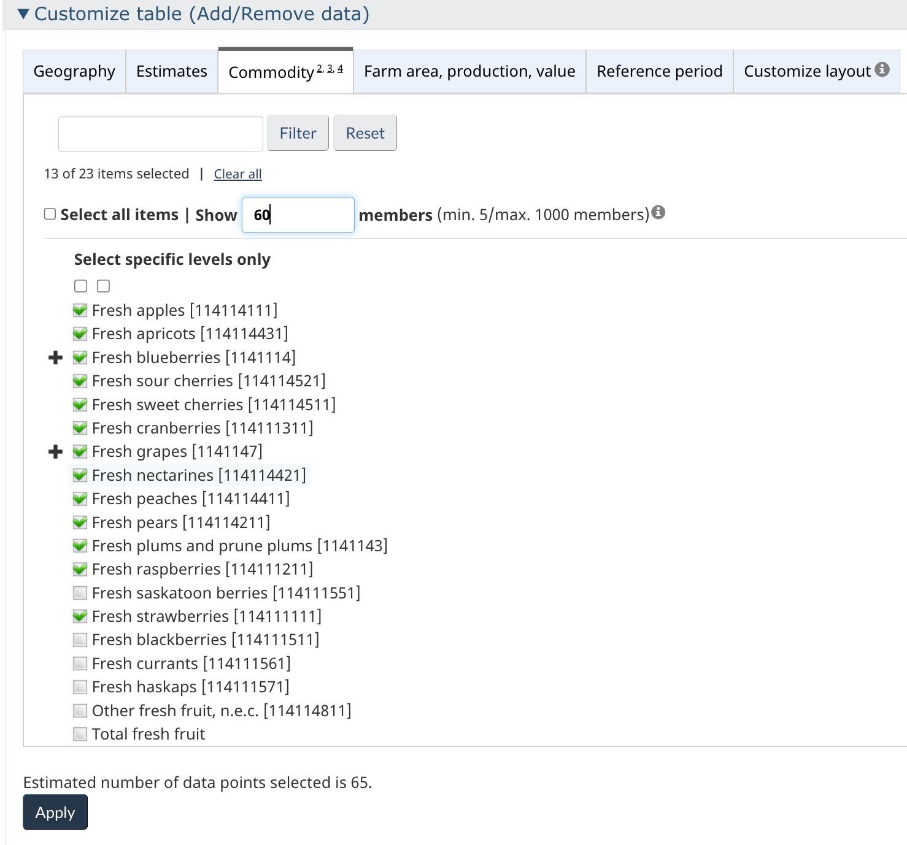
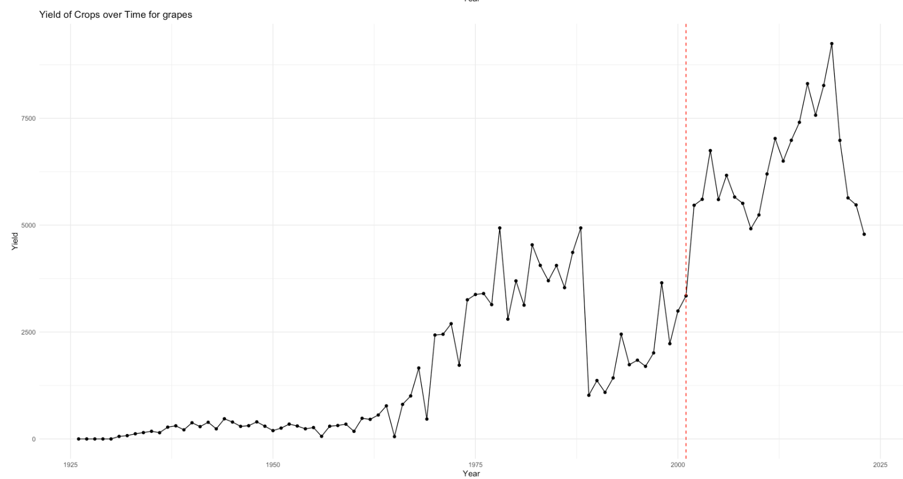
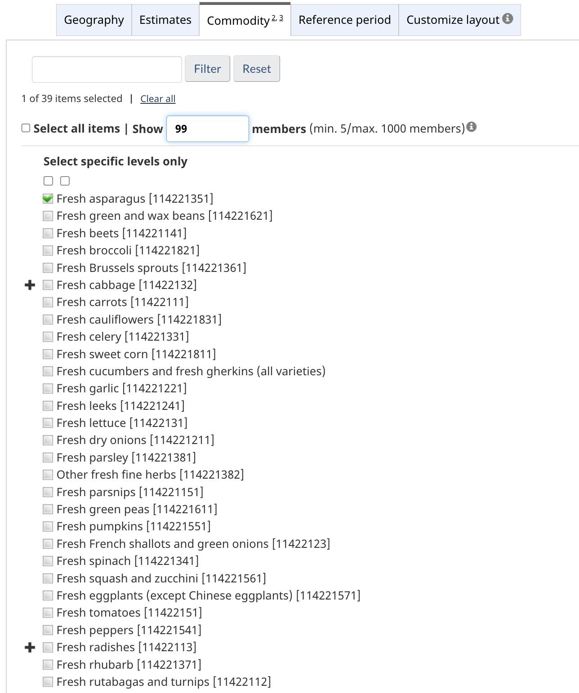
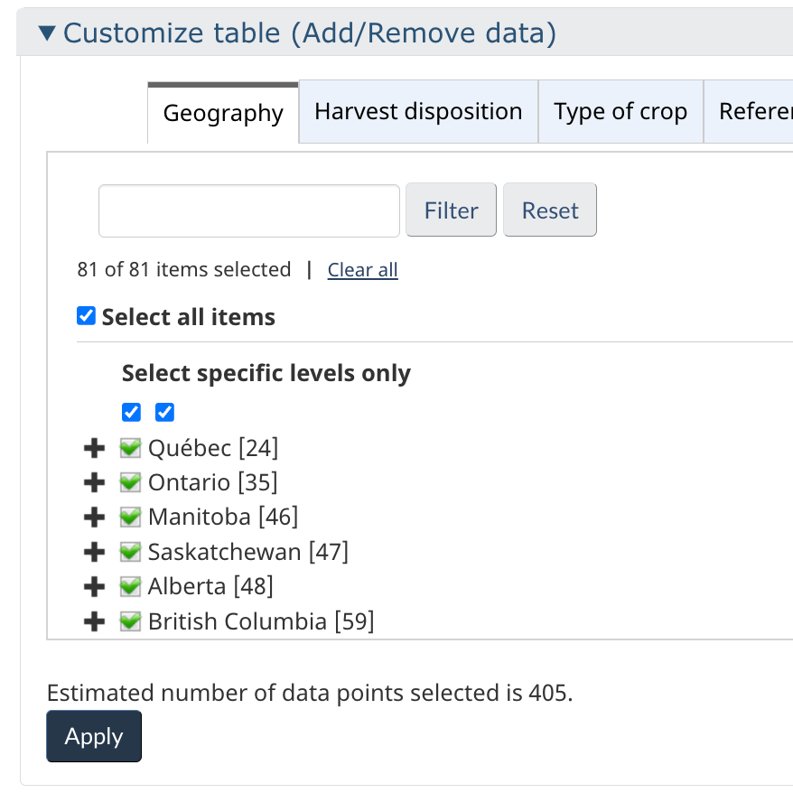
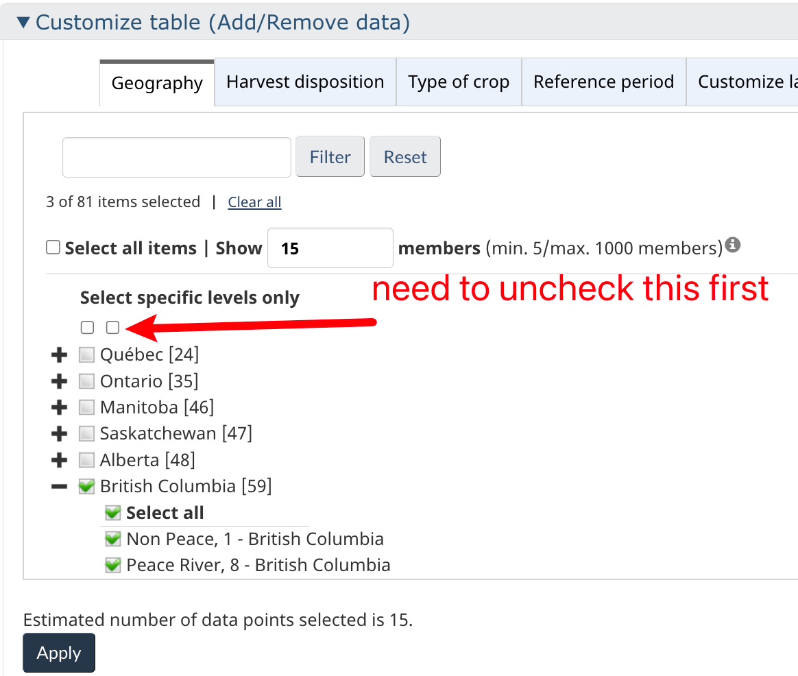

## Data Source Summary

This document provides a summary of various data sources used in our analysis, along with references to the R code that handles data reading and cleaning.

<br>

#### **1. Temperature Station**

#### 1.1 Description:

We are examining daily climate data from temperature stations across Canada, focusing on five key stations that are most representative of the entire province of British Columbia. The dataset includes the following columns:

**x**: Longitude

**y**: Latitude

**LOCAL_DATE**: Date in the format year-month-day **TOTAL_PRECIPITATION**: Total precipitation in mm

**STATION_NAME**: Name of the station

**MEAN_TEMPERATURE**: Mean of daily maximum and minimum temperatures

**MAX_TEMPERATURE**: Daily maximum temperature

**MIN_TEMPERATURE**: Daily minimum temperature

**TOTAL_RAIN**: Total rainfall

**MIN_REL_HUMIDITY**: Minimum relative humidity

**LOCAL_YEAR**: Year

**LOCAL_MONTH**: Month

*Our goal is to identify stations with data extending back to 1941 in order to compare the heatwave of 1941 with that of 2021.*

<br>

<br>

#### 1.2 Data Access

-   **Link to data source:** [Daily Climate Station Data](https://climate-change.canada.ca/climate-data/#/daily-climate-data)

-   Through the provided link, you can utilize the map tool to locate your desired station by either scrolling through the map or entering the station name or ID in the search bar.

-   Please ensure you download the data in CSV format, rather than GeoJSON.

-   (Specific station information, including location and ID, can be found in section 1.3.)

-   If the link does not work, the data can be accessed through the official website of the Government of Canada by following the navigation path outlined below: [Home](https://www.canada.ca/en.html) \> [Environment and natural resources](https://www.canada.ca/en/services/environment.html) \> [Climate change](https://www.canada.ca/en/services/environment/weather/climatechange.html) \> [Climate change: our plan](https://www.canada.ca/en/services/environment/weather/climatechange/climate-plan.html) \> [Adapting to Climate Change](https://www.canada.ca/en/environment-climate-change/services/climate-change/adapting.html) \> [Canadian Centre for Climate Services](https://www.canada.ca/en/environment-climate-change/services/climate-change/canadian-centre-climate-services.html) \> [Display and Download Climate Data](https://www.canada.ca/en/environment-climate-change/services/climate-change/canadian-centre-climate-services/display-download.html) \> [Climate data extraction tool](https://climate-change.canada.ca/climate-data/#/) \> Daily climate data (the link above)

<br>

<br>

#### 1.3 Weather Station Location & Year Range

#### **YVR**

year range: 1937-2024

| Station Name     | Start Year | End Year | Station ID | Start Date | End Date   |
|------------------|------------|----------|------------|------------|------------|
| VANCOUVER INTL A | 1937       | 2024     | 1108447    | 1937-01-01 | 2024-08-01 |
| VANCOUVER INTL A | 1937       | 2024     | 1108395    | 2013-06-13 | 2024-08-01 |

##### **location information:**

{width="566"}

##### <br>

##### <br>

#### **Abbotsford**

year range: 1935-2024

table:

| Station Name           | Start Year | End Year | Station ID | Start Date | End Date   |
|------------|------------|------------|------------|------------|------------|
| ABBOTSFORD A           | 2012       | 2024     | 1100032    | 2012-06-21 | 2024-07-30 |
| ABBOTSFORD A           | 1944       | 2024     | 1100030    | 1944-10-01 | 2012-06-20 |
| ABBOTSFORD UPPER SUMAS | 1935       | 1946     | 1100040    | 1935-11-01 | 1946-03-31 |

##### **location information:**

{width="556"}

##### <br>

##### <br>

#### **Prince_George**

year range: 1940-2024

table:

| Station Name  | Start Year | End Year | Station ID | Start Date | End Date   |
|---------------|------------|----------|------------|------------|------------|
| PRINCE GEORGE | 1942       | 2009     | 1096450    | 1942-07-01 | 2009-10-21 |
| PRINCE GEORGE | 2009       | 2024     | 1096439    | 2009-10-22 | 2024-07-30 |
| PRINCE GEORGE | 1912       | 1945     | 1096436    | 1912-08-01 | 1945-06-30 |

##### **location information :**

{width="569"} <br> <br> \#### **FortNelson**

year range: 1937-2024

table:

| Station Name  | Start Year | End Year | Station ID | Start Date | End Date   |
|---------------|------------|----------|------------|------------|------------|
| FORT NELSON A | 1937       | 2012     | 1192940    | 1937-09-01 | 2012-11-14 |
| FORT NELSON A | 2012       | 2024     | 1192946    | 2012-11-08 | 2024-07-30 |

##### **location information :**

{width="544"} <br> <br>

##### **Kelowna**

year range: 1899-2024

table:

| Station Name | Start Year | End Year | Station ID | Start Date | End Date   |
|--------------|------------|----------|------------|------------|------------|
| KELOWNA      | 1899       | 1962     | 1123930    | 1899-03-01 | 1962-09-30 |
| KELOWNA      | 1961       | 1969     | 1123975    | 1961-08-01 | 1969-11-30 |
| KELOWNA A    | 1968       | 2005     | 1123970    | 1968-10-01 | 2005-09-30 |
| KELOWNA      | 2005       | 2024     | 1123939    | 2005-09-03 | 2024-07-30 |
| KELOWNA UBCO | 2013       | 2024     | 1123996    | 2013-12-16 | 2024-07-30 |

##### **location information :**

{width="603"}

-   It is important to note that total precipitation data from 1123939 station (years 2009 to 2024) may be incomplete.

-   To ensure data integrity, particularly for calculating the maximum consecutive dry day, missing precipitation values have been supplemented with data from a nearby secondary UBC-O station.

-   Since treating missing data as zero would significantly distort the calculation of consecutive dry days.

-   The original Kelowna dataset contained 191 missing values, while the UBC-O dataset provided 343 complete data points. After supplementation, the Kelowna dataset now contains 132 missing values, indicating that 59 missing values were filled. within 2013-2024 period.

#### 1.4 Achieved

n the early stages of our analysis, we explored data from the following stations:

-   Kamloops: 1939-2024

-   Penticton: 1941-2024

For analyzing the relationship between temperature and field crop yield data, we picked the station from the Peach River region:

-   FortStJohn: 1910-2024

<br>

<br>

#### 1.5 R code for data reading & cleaning

-   The data is read using the `process_and_save_data()` function, located in `../climate_extreme_RA/R/read_data_(#accrodingly station name).R`

    -   Within the `process_and_save_data()` function, `deal_with_non_exist_date()` detects missing dates (i.e., dates that should be present based on the expected continuous time series but are absent). The function addresses these missing rows by adding rows for these dates and filling in `NA` for the other value columns.

        <br>

    -   **Note:** When there is an overlap in the date ranges of different station data, I manually(before running `process_and_save_data()` to read the data ) remove the rows with overlapping dates from the older station data and retain the corresponding rows from the newer station data.

        For example, given two date ranges:

        -   Station A: October 1, 1944, to June 20, 2012

        -   Station B: November 1, 1935, to March 31, 1946

        I will preserve the data from Station B for the period from November 1, 1935, to September 30, 1944, and the data from Station A for the period from October 1, 1944, to June 20, 2012.This adjusted data then becomes the original raw data.

-   The raw data path is specified at the beginning of each station's analysis R Markdown file, located in `../climate_extreme_RA/reports_station/(# According Station Name)_heatwave_analysis.Rmd`

<br>

### **2 ERA5**

#### 2.1 Description:

<!-- This dataset provide the -->

<!-- 1.data 介绍 -->

<!-- 2 web 介绍 (关于如何取grid 见onneonte) 如何script 介绍 -->

<!-- 3 code 介绍 -->

<!-- (看onenote 关于时区) -->

<!-- week 3 4 -->

### **3 STATCanada Potato data**

<br>

#### 3.1 Description:

-   Dataset ID: "Table: 32-10-0358-01 (formerly CANSIM 001-0014)"
-   Year Range: 1910-2024
-   Frequency: Annual
-   Variables: Avg Yield, unit is Hundredweight per harvested acre
-   Geography: Canada, Province-wide: British Columbia (BC); Other provinces
-   Rationale for choosing potatoes: According to [@potato-heat], potatoes are highly vulnerable to high temperatures, which negatively impact tuber development, storage, and seed potato fitness. To investigate the potential correlation between temperature extremes, including heat waves, and long-term yield patterns in British Columbia, a comprehensive yield dataset is required. <br>

<br>

#### 3.2 Data Access

**Link to data source:** [Statistics Canada](https://www150.statcan.gc.ca/t1/tbl1/en/cv.action?pid=3210035801)

If the link does not work, the data can be accessed through the official website of the Statistics Canada by following the navigation path outlined below:

[Home](https://www150.statcan.gc.ca/n1/en) \> [Data](https://www150.statcan.gc.ca/n1/en/type/data?MM=1#tables) (in the search bar, search for "Area, production and farm value of potatoes" or Dataset ID: 32-10-0358-01) \> [Area, production and farm value of potatoes](http://www150.statcan.gc.ca/t1/tbl1/en/tv.action?pid=3210035801)

<br>

#### 3.3 Select and download data in the web

-   **Step1**: click the Add/Remove button

    {width="621"}

<br>

-   **Step2**: the pic below shows the layout of column filter option

    -   **Step2.1** Select the Geography:

        {width="291"}

        -   Click on the **Geography** tab.

        -   Don't Check the box next to "Canada" as it will include nationwide data for the entire country.

        -   Expand the list by clicking the "+" symbol next to "Canada." and select the desired provinces: British Columbia (BC).

    <br>

    -   **Step2.2** Choose the Variables:

        -   Navigate to the **Area, production and farm value of potatoes** tab.

        -   From the list of available variables, select only `Average yield, potatoes`

    <br>

    -   **Step2.3** Click on the **Reference period** tab:

        -   Select the years, ranging from 1910 to 2024.

    -   **Step2.4** Customize the Layout:

        -   Adjust the layout settings as preferred.

        -   Note that these settings will only affect the display of the dataset on the website and will not influence the structure of the data when it is downloaded.

<br>

-   **Step 3**: Download the dataset 

    -   First Click on the "Download options" Button, then from the list of available download formats, choose the "Download selected data (for database loading)."

#### 3.4 R code for data reading & wrangling

-   The data is read within `../climate_extreme_RA/R_agricultural/read_data.R`T
-   The final data is called data_pot

``` r
# File paths for Potato data 
file_paths <- c("../data/agri/Potato_Data.csv") 
# Define the columns needed,UOM is unit, VALUE is yield 
needed_columns <- c("REF_DATE", "VALUE","UOM") 
# Function to read and select necessary columns, and add crop type 
read_and_select_pot <- function(file_path) { 
  read_csv(file_path) %>% select(all_of(needed_columns)) } 
# Read and combine all datasets 
data_pot <- map_dfr(file_paths, read_and_select_pot) 
#create new column called crop type 
data_pot$Crop_Type <- "Potato"
```

-   `../climate_extreme_RA/R_agricultural/model_potato.R` uses a Moving Average to Detrend Time Series yield Data(transfer from Blue line to red line)

-   Then, the functions within the file are employed as follows: `lm_monthly_potato` and `lm_season_potato`are used to fit potato yield which is annually yield across British Columbia, VS EHF (utilizing daily maximum EHF from ***Kelowna*** as independent variables, aggregated into monthly or seasonal maximums for each year) through linear regression.

-   Additionally,`lm_onemonth_potato`is used to fit 12 single-month EHF versus yield linear regressions.

#### 3.5 Conclusion

-   The adjusted R-squared values are low for all linear models, and the correlation, as observed through scatter plots,varies and is difficult to discern.

-   Upon examining the daily EHF curves from the 40 highest and 40 lowest yield years, no clear pattern distinguishes the curves between high and low yield years.

-   This detailed analysis can be found in the report located at `../climate_extreme_RA/reports_station/Kelowna_heatwave_analysis.Rmd` and `../climate_extreme_RA/report_agricultural/agri_lm_model.Rmd` in `Part 2: patato data`

### **4 STATCanada Fruits data**

#### 4.1 Description:

-   Dataset ID: "Table: 32-10-0364-01 (formerly CANSIM 001-0009)"

-   Year Range: 1926-2024

-   Frequency: Annual

-   Variables:

    -   Marketed production from 1926-2024, unit in ton

    -   Total Cultivated area from 2002- 2024, unit hectares

-   Geography: Canada, Province-wide: British Columbia (BC); Other provinces

To investigate the potential correlation between temperature extremes, including heat waves, and long-term yield patterns in British Columbia, a comprehensive yield dataset is required.

Therefore, it is necessary to estimate the total cultivated area for years prior to 2002 to cover a longer period, as marketed production data is available from 1926 to 2024.

<br>

#### 4.2 Data Access

**Link to data source:** [Statistics Canada](https://www150.statcan.gc.ca/t1/tbl1/en/tv.action?pid=3210036401&pickMembers%5B0%5D=1.13&pickMembers%5B1%5D=2.8&pickMembers%5B2%5D=4.4&cubeTimeFrame.startYear=2011&cubeTimeFrame.endYear=2023&referencePeriods=20110101%2C20230101)

If the link does not work, the data can be accessed through the official website of the Statistics Canada by following the navigation path outlined below:

[Home](https://www150.statcan.gc.ca/n1/en) \> [Data](https://www150.statcan.gc.ca/n1/en/type/data?MM=1#tables) (in the search bar, search for "**Area, production and farm gate value of marketed fruits**" or Dataset ID: 32-10-0364-01) \> [Area, production and farm value of marketed fruits](https://www150.statcan.gc.ca/t1/tbl1/en/tv.action?pid=3210036401&pickMembers%5B0%5D=1.13&pickMembers%5B1%5D=2.8&pickMembers%5B2%5D=4.4&cubeTimeFrame.startYear=2011&cubeTimeFrame.endYear=2023&referencePeriods=20110101%2C20230101)

<br>

#### 4.3 Select and download data in the web

-   **Step1**: click the Add/Remove button

    

<br>

-   **Step2**: the pic below shows the layout of column filter option

    -   **Step2.1** Select the Geography:

        {width="302"}

        -   Click on the **Geography** tab.

        -   Don't check the box next to "Canada" as it will include nationwide data for the entire country.

        -   Expand the list by clicking the "+" symbol next to "Canada." and select the desired provinces: British Columbia (BC).

    <br>

    -   **Step2.2** Choose the Variables:

        -   Navigate to the **Estimates** tab.

        -   From the list of available variables, select `Marketed production` and `Cultivated area, total`

    <br>

    -   **Step2.3** Choose the **Commodity** tab:

        

        -   Please check the box next to the type of fruit you want.

        -   **Important:** To view all types of fruits, ensure you enter a sufficiently large number in the "Show XXX Members" tab; otherwise, some fruit types may be hidden.

    -   **Step2.4** Click on the **Farm area, production, value** tab:

        -   click the according unit matches the Estimates we selected.

    -   **Step2.5** Click on the **Reference period** tab:

        -   Select the years, ranging from 1910 to 2024.

    -   **Step2.6** Customize the Layout:

    -   Adjust the layout settings as preferred.

    -   Note that these settings will only affect the display of the dataset on the website and will not influence the structure of the data when it is downloaded.

<br>

-   **Step 3**: Download the dataset 

    -   First Click on the "Download options" Button, then from the list of available download formats, choose the "Download selected data (for database loading)."

#### 4.3 R code for data reading & wrangling

-   The data is read within `../climate_extreme_RA/R_agricultural/read_data.R`
-   The final data is called data_statcan_fruit

``` r

# File paths for Canola, Barley, and Fruit data
file_paths <- c("../data/agri/Fruit_prod.csv",
                "../data/agri/Fruit_area.csv")

# Define the columns needed
#unit is ton
needed_columns <- c("REF_DATE", "VALUE", "Commodity","Estimates","UOM")

# Function to read and select necessary columns, and add crop type
read_and_select_fru <- function(file_path) {
  read_csv(file_path) %>%
    select(all_of(needed_columns))%>% 
    rename(Crop_Type = Commodity)
}

# Read and combine all datasets
data_statcan_fruit <- map_dfr(file_paths, read_and_select_fru)


# Convert the data types
data_statcan_fruit$REF_DATE <- as.integer(data_statcan_fruit$REF_DATE)
data_statcan_fruit$VALUE <- as.numeric(data_statcan_fruit$VALUE)

#check num of missing
sum(is.na(data_statcan_fruit))
```

-   Within the `../climate_extreme_RA/report_agricultural/FAOSTAT.Rmd`

    In Part 4: New Crop Data, Section 4.2: Fruits Data, we present:

    1.  A line plot illustrating all fruit yield data from 2002 to 2024.

    2.  A line plot for marketed production (in tons) and total cultivated area (in hectares).

    3.  A line plot showing the total cultivated area (in hectares), with the overall mean value applied for years prior to 2002.

#### 4.4 Conclusion

-   Using the mean for past years' area data (before the red dash line) is not ideal, as demonstrated by the yield data for apples and grapes shown below.

{width="650"}{width="713"}

-   We could analyze the yield data from the past 20 years in relation to EHF to identify any potential patterns. This approach may provide insights into the correlation between extreme heat events and yield fluctuations.

-   However, for a more comprehensive analysis, additional area data is necessary. A

<!-- agriculture -->

<!-- 5 fao -->

<!-- 6 stat canada -->

<!-- 6.1 potato -->

<!-- 6.2 veg -->

<!-- 6.3 fruits -->

<!-- 6.4 field crop -->

<!-- ## paper -->

### **5 STATCanada Vegetable data**

#### 5.1 Description:

-   Dataset ID: "Table: 32-10-0365-01 (formerly CANSIM 001-00013)"

-   Year Range: 1940-2024

-   Frequency: Annual

-   Variables:

    -   Average yield per hectare (kilograms)

    -   Average yield per acre (pounds)

        **Comment**: yield data is from 1940-2017

    <br>

    -   Area planted (acres)

    -   Area planted (hectares)

    -   Area harvested (hectares)

    -   Area harvested (acres)

    <br>

    -   Marketed production (tons)

    -   Marketed production (metric tonnes)

    -   Total production (tons)

    -   Total production (metric tonnes)

-   Geography: Canada, Province-wide: British Columbia (BC); Other provinces

To investigate the potential correlation between temperature extremes, including heat waves, and long-term yield patterns in British Columbia, a comprehensive yield dataset is required.

Therefore, it is necessary to estimate the yield data after 2017 to 2024.

<br>

#### 5.2 Data Access

**Link to data source:** [Statistics](https://www150.statcan.gc.ca/t1/tbl1/en/tv.action?pid=3210036401&pickMembers%5B0%5D=1.13&pickMembers%5B1%5D=2.8&pickMembers%5B2%5D=4.4&cubeTimeFrame.startYear=2011&cubeTimeFrame.endYear=2023&referencePeriods=20110101%2C20230101)[Canada](https://www150.statcan.gc.ca/t1/tbl1/en/cv.action?pid=3210036501)

If the link does not work, the data can be accessed through the official website of the Statistics Canada by following the navigation path outlined below:

[Home](https://www150.statcan.gc.ca/n1/en) \> [Data](https://www150.statcan.gc.ca/n1/en/type/data?MM=1#tables) (in the search bar, search for "**Area, production and farm gate value of marketed vegetables**" or Dataset ID: 32-10-0365-01) \> [Area, production and farm value of marketed vegetables](https://www150.statcan.gc.ca/t1/tbl1/en/tv.action?pid=3210036401&pickMembers%5B0%5D=1.13&pickMembers%5B1%5D=2.8&pickMembers%5B2%5D=4.4&cubeTimeFrame.startYear=2011&cubeTimeFrame.endYear=2023&referencePeriods=20110101%2C20230101)

<br>

#### 5.3 Select and download data in the web

-   **Step1**: click the Add/Remove button

    

<br>

-   **Step2**: the pic below shows the layout of column filter option

    -   **Step2.1** Select the Geography:

        {width="302"}

        -   Click on the **Geography** tab.

        -   Don't check the box next to "Canada" as it will include nationwide data for the entire country.

        -   Expand the list by clicking the "+" symbol next to "Canada." and select the desired provinces: British Columbia (BC).

    <br>

    -   **Step2.2** Choose the Variables:

        -   Navigate to the **Estimates** tab.

        -   From the list of available variables, select all except `Farm gate value (dollars)`

    <br>

    -   **Step2.3** Choose the **Commodity** tab:

        

        -   Please check the box next to the type of fruit you want.

        -   **Important:** To view all types of fruits, ensure you enter a sufficiently large number in the "Show XXX Members" tab; otherwise, some fruit types may be hidden.

    -   **Step2.4** Click on the **Reference period** tab:

        -   Select the years, ranging from 1910 to 2024.

    -   **Step2.5** Customize the Layout:

    -   Adjust the layout settings as preferred.

    -   Note that these settings will only affect the display of the dataset on the website and will not influence the structure of the data when it is downloaded.

<br>

-   **Step 3**: Download the dataset 

    -   First Click on the "Download options" Button, then from the list of available download formats, choose the "Download selected data (for database loading)."

#### 5.4 R code for data reading & wrangling

-   The data is read within `../climate_extreme_RA/R_agricultural/read_data.R`
-   The final data is called data_veg_1940

``` r
# Read the CSV file
file_paths <- c("../data/agri/Vegetable_Data.csv")
# Define the columns needed
needed_columns <- c("REF_DATE", "Estimates","VALUE","Commodity","UOM")
read_and_select <- function(file_path) {
  read.csv(file_path) %>%
    select(all_of(needed_columns))%>% 
    rename(Crop_Type = Commodity)
}
# Read and combine all datasets
data_veg <- map_dfr(file_paths, read_and_select)

#na
sum(is.na(data_veg$VALUE))
# Impute missing VALUEs with the mean of neighboring VALUEs
data_veg <- data_veg %>%
  group_by(Crop_Type,Estimates) %>%
  mutate(VALUE = na.approx(VALUE, rule = 2))
sum(is.na(data_veg$VALUE))

# Clean the Crop_Type column by removing "Fresh" and the numbers
data_veg$Crop_Type <- gsub("Fresh ", "", data_veg$Crop_Type)
data_veg$Crop_Type <- gsub("\\s*\\[.*\\]", "", data_veg$Crop_Type)

#NUM of crop type
length(unique(data_veg$Crop_Type))
#filter some veg out, keep only long term data
data_veg_1940 <- data_veg %>% 
  filter(Crop_Type != "broccoli" & Crop_Type != "Brussels sprouts" & Crop_Type != "eggplants (except Chinese eggplants)" & 
           Crop_Type != "French shallots and green onions" &  Crop_Type != "garlic" &  
           Crop_Type != "Other fresh fine herbs" &  Crop_Type != "Other fresh melons" &  
           Crop_Type != "Other fresh vegetables" &  Crop_Type != "parsley" &  
           Crop_Type != "peppers" &  Crop_Type != "pumpkins" &  Crop_Type != "radishes" &  
           Crop_Type != "squash and zucchini" &  Crop_Type != "sweet potatoes" &  
           Crop_Type != "Total fresh vegetables" &  Crop_Type != "watermelons" &  
           Crop_Type != "rhubarb"  &
           Crop_Type != "leeks" &  Crop_Type != "tomatoes" &  Crop_Type != "cucumbers and fresh gherkins (all varieties)")
length(unique(data_veg_1940$Crop_Type))


veg_year_2<- data_veg_1940 %>%
  group_by(Crop_Type,Estimates) %>%
  summarize(Start_Year = min(REF_DATE), End_Year = max(REF_DATE))
```

-   In the script located at `../climate_extreme_RA/R_agricultural/explore_qualified_crop.R`, we are tasked with calculating and populating the average yield values for the years 2017 to 2024 (since it is missing from the original yield data) through the `calculate_yields()`.

    -   This involves handling two types of production data and two types of area data, each in different units.

    -   We aim to calculate the yields for all combinations and subsequently compare these yields with the original yield data from 1940 to 2017.

    -   Based on this comparison, we determine that:**Marketed production (tons transfer to kg) and Area harvested (hectares)** should be utilized.

-   Upon selecting the appropriate columns and calculating the yields for 2017 to 2024, the next step involves analysis the results within `../climate_extreme_RA/report_agricultural/agri_lm_model.Rmd`.

    -   In `Part 1: Vegetation Data`, a comparative analysis of the calculated yields versus the original historical yields is presented.

    -   Crops will be classified into five groups based on the quality of the simulated yield.

        -   Good quality will be defined as a perfect match between the calculated yield and the historical yield

            

        -   While poor quality will be indicated by the presence of outliers or significant discrepancies between the two sets of yield data.

            

#### 5.5 Conclusion

-   Research is required to determine which types of fruits are highly influenced by heat waves or cold waves. Additionally, data must be adjusted to reflect the full agricultural cycle year for each crop.

-   For instance, if the 2021 yield data for Crop A corresponds to planting in March 2021 and harvesting in October 2021, the climate data for the year 2021 will be used, as the entire crop cycle falls within the same calendar year.

-   However, if the 2021 yield data pertains to crops planted in November or December 2020 and harvested in May 2021, in this case, the "year" for climate data should reflect the period from the planting season in late 2020 through the harvesting season in 2021.

<!-- agriculture -->

<!-- 5 fao -->

<!-- 6 stat canada -->

<!-- 6.1 potato -->

<!-- 6.2 veg -->

<!-- 6.3 fruits -->

<!-- 6.4 field crop -->

<!-- ## paper -->

### **6 STATCanada Field Crop data**

#### 6.1 Description:

-   Dataset ID: "Table: 32-10-0002-01 (formerly CANSIM 001-0071)"

-   Year Range: 1990-2024

-   Frequency: Annual

-   Variables:

    -   Average yield per hectare (kilograms)

    -   Average yield per acre (pounds)

-   Geography: Canada, Province-wide: British Columbia (BC); Other provinces

<br>

#### 6.2 Data Access

**Link to data source:** [Statistics](https://www150.statcan.gc.ca/t1/tbl1/en/tv.action?pid=3210036401&pickMembers%5B0%5D=1.13&pickMembers%5B1%5D=2.8&pickMembers%5B2%5D=4.4&cubeTimeFrame.startYear=2011&cubeTimeFrame.endYear=2023&referencePeriods=20110101%2C20230101)[Canada](https://www150.statcan.gc.ca/t1/tbl1/en/tv.action?pid=3210000201)

If the link does not work, the data can be accessed through the official website of the Statistics Canada by following the navigation path outlined below:

[Home](https://www150.statcan.gc.ca/n1/en) \> [Data](https://www150.statcan.gc.ca/n1/en/type/data?MM=1#tables) (in the search bar, search for "**Estimated areas, yield and production of principal field crops by Small Area Data Regions, in metric and imperial units**" or Dataset ID: 32-10-0002-01) \> [Estimated areas, yield and production of principal field crops by Small Area Data Regions, in metric and imperial units](http://www150.statcan.gc.ca/t1/tbl1/en/tv.action?pid=3210000201)

<br>

#### 6.3 Select and download data in the web

-   **Step1**: click the Add/Remove button

    

<br>

-   **Step2**: the pic below shows the layout of column filter option{width="451"}

    -   **Step2.1** Select the Geography:

        

        -   Click on the **Geography** tab.

        -   Check the box next to "British Columbi"

        -   Expand the list by clicking the "+" symbol next to "Canada." and select the rest region.

        -   we picked the station FortStJohn: 1910-2024 from the Peach River region for analysis.

    <br>

    -   **Step2.2** Choose the Variables:

        -   Navigate to the **Harvest disposition** tab.

        -   

        -   [Harvest disposition](https://www150.statcan.gc.ca/t1/tbl1/#panel18298)

        -   

        -   [Reference period](https://www150.statcan.gc.ca/t1/tbl1/#timeframe)

        -   [Customize layout](https://www150.statcan.gc.ca/t1/tbl1/#layout)

        -   From the list of available variables, select Averave yield.

    <br>

    -   **Step2.3** Choose the **Type of crop** tab:

        

        -   Please check the box next to `Oat`, `Barley`, `Peas,dry`, `Rye, fall remaining`, `Wheat, spring` and `Canola` as other crop is missing for BC.

        -   **Important:** To view all types of fruits, ensure you enter a sufficiently large number in the "Show XXX Members" tab; otherwise, some fruit types may be hidden.

    -   **Step2.4** Click on the **Reference period** tab:

        -   Select the years, ranging from 1990 to 2024.

    -   **Step2.5** Customize the Layout:

    -   Adjust the layout settings as preferred.

    -   Note that these settings will only affect the display of the dataset on the website and will not influence the structure of the data when it is downloaded.

<br>

-   **Step 3**: Download the dataset 

    -   First Click on the "Download options" Button, then from the list of available download formats, choose the "Download selected data (for database loading)."

#### 6.4 R code for data reading & wrangling

-   The data is read within `../climate_extreme_RA/R_agricultural/read_data.R`
-   The final data is called data_statcan_crop

``` r
# Read the CSV file
file_paths <- c("../data/agri/FieldCropsEstimates.csv")

# Define the columns needed
needed_columns <- c("REF_DATE", "Harvest.disposition","VALUE",'GEO',"Type.of.crop","UOM")

# Function to read and select necessary columns, and add crop type
read_and_select <- function(file_path) {
  read.csv(file_path) %>%
    select(all_of(needed_columns)) %>%
    #rename(Production = VALUE) %>%
    rename(Crop_Type = Type.of.crop)
}

# Read and combine all datasets
data_statcan_crop <- map_dfr(file_paths, read_and_select)


#filter Harvest.disposition to be Average yield (kilograms per hectare)
crop_yield <- data_statcan_crop %>% filter(Harvest.disposition == "Average yield (kilograms per hectare)")
total_produ <- data_statcan_crop %>% filter(Harvest.disposition == "Production (metric tonnes)")

#rename
crop_yield <- crop_yield %>% rename(yield = VALUE)
total_produ <- total_produ %>% rename(Production = VALUE)
# Impute missing values with the mean of neighboring values
crop_yield <- crop_yield %>%
  group_by(Crop_Type,GEO) %>%
  mutate(yield = na.approx(yield, rule = 2))

total_produ <- total_produ %>%
  group_by(Crop_Type,GEO) %>%
  mutate(Production = na.approx(Production, rule = 2))
```

#### 6.5 Conclusion

-   The dataset only contains 30 years of data. However, there is specific regional data available, and further analysis can be conducted using temperature data from stations such as Fort St. John in the Peace River region.

<!-- agriculture -->

<!-- 5 fao -->

<!-- 6 stat canada -->

<!-- 6.1 potato -->

<!-- 6.2 veg -->

<!-- 6.3 fruits -->

<!-- 6.4 field crop -->

<!-- ## paper -->

# Reference
